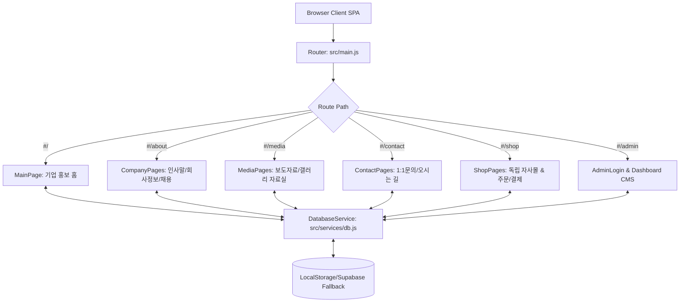

# AETERNO Premium Cosmetic Web Platform & Independent Store
## 📋 종합 프로젝트 기획 및 기능 개발 명세서

본 문서는 Vite, Vanilla JS, Vanilla CSS, 그리고 브라우저 내장 LocalStorage 기반으로 구축된 프리미엄 코스메틱 브랜드 **에테르노(AETERNO)**의 기업 소개 웹사이트 및 독립 자사몰 통합 시스템에 대한 종합 기획서이자 기능 개발 명세서입니다.

---

## 1. 브랜드 기획 & 디자인 컨셉 (Branding & Aesthetics)

* **브랜드 아이덴티티**: 자연 본연의 변치 않는 아름다움을 생명과학 기술로 구현하는 프리미엄 바이오 코스메틱 브랜드.
* **디자인 테마 (Google Stitch Concept 기반)**:
  - **메인 테마 컬러**: 깊은 우주의 느낌을 주는 **매트 오닉스 차콜 블랙** (`hsl(220, 16%, 6%)`) 배경.
  - **포인트/액센트 컬러**: 따뜻하고 몽환적인 **로즈 골드 그라데이션** (`hsl(25, 45%, 72%)`) 및 차분한 퍼플 인디고.
  - **오로라 백그라운드 블롭 (Aurora Glow)**: 배경 화면 뒤편에 고정 배치된 은은하게 번지는 입체 그라데이션 글로우 효과 (`body::before`, `body::after` 가상 요소를 통한 Radial-Gradient 연출).
  - **글래스모피즘 (Glassmorphism)**: 보더 선 폭을 `1px`로 매우 얇게 줄이고 블러 반경을 `24px` 이상으로 강하게 주어 투명 유리를 얹어놓은 듯한 초현대적인 깊이감 형성.
  - **Pill(캡슐형) 디자인**: 주요 버튼, 사이드바 링크, 수량 조절 및 태그 칩 등을 둥근 필 형태로 구성하여 부드러운 하이엔드 디지털 감성 구현.
  - **마이크로 모션**: 페이지 렌더링 시 콘텐츠가 스무스하게 솟아오르며 블러 상태가 선명해지는 `fadeInUp` 애니메이션 및 `cubic-bezier(0.16, 1, 0.3, 1)` 기반의 쫀득한 호버링 효과.

---

## 2. 시스템 아키텍처 & 데이터 흐름 (Architecture)



* **SPA 해시 라우팅**: 클라이언트 해시 기반 라우터(`src/main.js`)를 통해 화면 이동 시 깜빡임 없이 부드러운 스크롤 및 화면 전환을 제공합니다.
* **오프라인 우선 저장소 구조 (Duality Database Pattern)**:
  - `DatabaseService` 인터페이스 하위에 `LocalStorageDbService`와 `SupabaseDbService`가 상호 교환식으로 설계되었습니다.
  - 네트워크 연결 해제(`ENOTFOUND`) 상황을 고려하여 브라우저 로컬 저장소(`localStorage`) 기반 데이터를 기본 동작 모드로 작동하며, 시스템 안정성을 극대화했습니다.

---

## 3. 웹사이트 메뉴 및 기능 명세 (Feature Specifications)

### 3.1 기업 브랜드 소개 사이트 (Corporate Web)
쇼핑몰이 활성화되지 않았거나 일반 브랜딩 페이지를 브라우징하는 경우 노출되는 영역입니다. 이 영역의 헤더에는 쇼핑 외적인 혼선을 방지하기 위해 **"쇼핑몰" 바로가기 링크만 심플하게 표시**됩니다.

* **Home (`#/`)**:
  - 프리미엄 로즈 골드 그라데이션이 적용된 메인 Hero 슬라이드 배너.
  - 에테르노 시그니처 3대 대표 상품 쇼케이스 카드.
  - 브랜드 철학 및 바이오 스킨케어 스토리텔링 영역.
  - 최신 배포 보도자료 2선 숏컷.
  - 쇼핑몰 다이렉트 전환 배너.
* **회사소개 (Dropdown Menu)**:
  - **대표이사 인사말 (`#/about/ceo`)**: 대표이사의 신년사 및 인물 컷 프로필.
  - **회사정보 (`#/about/info`)**: 대표자명, 사업자번호, 대표전화, 주소 등 주요 법인 개요 정보 제공.
  - **인재채용 (`#/about/careers`)**: 부서별 채용 목록을 제공하며 모집중(`OPEN`) 및 마감(`CLOSED`) 라벨이 어드민 설정 상태에 따라 실시간 반영.
* **제품소개 (`#/products`)**:
  - 가격 정보나 "장바구니 담기"가 없는 **순수 전시용 갤러리 그리드** 페이지.
  - 개별 상품 카드 클릭 시 성분 설명 및 사용법이 포함된 상세 페이지로 연결.
* **미디어랩 (Dropdown Menu)**:
  - **보도자료 (`#/media/press`)**: 브랜드 최신 언론 보도글 리스트 및 YouTube API 규격 기반의 비디오 재생 브랜드 영상관.
  - **갤러리 (`#/media/gallery`)**: 화보 룩북 아카이브 및 제품 브로셔 / 분석 성적표 PDF 다운로드 자료실 구조.
* **Contact Us (Dropdown Menu)**:
  - **문의게시판 (`#/contact/inquiry`)**: 이름, 연락처, 이메일, 제목, 내용을 입력하여 1:1 고객 Inquiry를 실시간 접수하는 양식 폼.
  - **오시는 길 (`#/contact/map`)**: 오피스 본사 상세 주소 안내 및 반응형 구글 맵 iframe 임베딩.

---

### 3.2 독립 쇼핑몰 영역 (Shop Mode & Commerce)
어드민 콘솔의 [시스템 설정] 탭에서 '쇼핑몰 연결' 스위치를 ON할 때 동작하는 독립 자사몰입니다. 쇼핑몰 도메인 내부로 유저가 진입하면 네비게이션 헤더가 **커머스 전용 헤더로 완전히 전환**됩니다.

* **쇼핑몰 전용 네비바**:
  - 로고가 `AETERNO STORE`로 변동되며, `All Products`, `Skincare` (기초화장품 필터), `Makeup` (색조화장품 필터), `Devices` (미용기구 필터)의 쇼핑 카테고리 메뉴가 배치됩니다.
  - 우측에 실시간 수량 배지가 결합된 **장바구니(Cart) 플로팅 드로어 버튼**, **로그인/회원가입** 링크가 동적 마운트됩니다.
  - 언제든지 메인 기업 소개 사이트로 돌아갈 수 있도록 **"회사홈페이지"** 귀환 버튼이 제공됩니다.
* **상품 리스트 & 상세 보기 (`#/shop`, `#/shop/product/:id`)**:
  - 카테고리 필터링이 URL 파라미터(`cat=skincare` 등)와 연동되어 매끄럽게 필터링됩니다.
  - 수동 품절 처리(`SOLD OUT` 오버레이 및 장바구니 담기 버튼 비활성화) 스위칭.
  - 정가 대비 할인가가 존재할 경우 자동 할인율 퍼센티지(`-%`) 배지 출력.
  - 수량 증감 셀렉터 및 바로구매(결제 페이지로 직통 이동) 기능 제공.
* **장바구니 드로어 (Cart Drawer)**:
  - 화면 우측에서 부드럽게 미끄러져 나오는 반투명 블러 백드롭 드로어.
  - 보관 아이템 수량 가감, 실시간 배송비 무료 달성 게이지 바 연동.
* **보안 회원인증 및 개인화 (`#/shop/login`, `#/shop/register`, `#/shop/mypage`)**:
  - 가입 시 기본 주소지와 배송 연락처를 사전에 입력해 주문서 작성을 가속화합니다.
  - 마이페이지 내에서 개인 회원의 누적 주문 이력 및 배송 처리 현황을 투명하게 추적할 수 있습니다.
* **주문 & 결제 (`#/checkout`, `#/order-complete`)**:
  - 회원 정보 주소 자동 로드 및 배송 요청사항 메모 작성.
  - **무료배송 임계치 자동 계산**: 기본 배송비 부과 또는 무료배송 기준 금액 초과 시 배송비 `0원` 자동 산정.
  - 무통장 가상 계좌 안내 및 비회원을 위한 고유 주문번호(`ORD-YYYYMMDD-랜덤번호`) 발급.
  - 비회원 전용 주문조회 폼(`#/shop/orders`)을 통해 주문번호와 휴대폰 번호 매칭만으로 실시간 배송 처리 현황 열람 가능.

---

## 4. 통합 어드민 대시보드 CMS (`#/admin/dashboard`)

사이트 전반의 마케팅 텍스트, 채용 정보, 미디어 자료실, 상품 목록, 주문 데이터, 고객 상담문의를 통합 제어할 수 있는 관리자 백오피스입니다.

### 4.1 관리자 로그인 및 보안 정책
* **최초 관리자 자격 증명**:
  - 아이디: `siteadmin`
  - 초기 임시 비밀번호: `!admin1004`
* **임시 비밀번호 강제 변경(Force Reset) 프로세스**:
  - 최초 임시 비밀번호로 로그인 성공 시, 대시보드 접근 권한이 즉시 유예되며 화면 전체에 **"비밀번호 변경 강제 모달"**이 팝업됩니다.
  - 관리자는 6자리 이상의 영문/숫자/특수기호가 결합된 안전한 새 비밀번호를 설정해야 합니다.
  - 비밀번호 저장 시 브라우저 내장 Subtle Crypto API의 **SHA-256 비동기 단방향 암호화**를 수행해 해시값 형태로 LocalStorage에 보관하여 정보 유출을 근본적으로 차단합니다.
  - 변경이 정상 완료되면 데이터베이스의 `isPasswordChanged` 플래그가 `true`로 설정되며 정식 세션을 발급받아 대시보드 제어판에 정상 접속됩니다.

### 4.2 대시보드 7대 핵심 제어 탭 명세
1. **대시보드 (Dashboard)**:
   - 신규 입금 대기 주문 수량, 미답변 문의 사항, 총 가입 고객 회원수, 누적 누계 매출액 통계 수치를 한눈에 보여주는 브리핑 보드.
2. **콘텐츠 관리 (Contents)**:
   - **인사말**: 대표이사 사진 파일 주소 및 인사말 텍스트 실시간 수정.
   - **회사정보**: 법인 개요 및 반응형 약도 구글 맵 임베드 URL 교체.
   - **인재채용**: 공고 추가, 상세 직무 설명 수정 및 채용 종료/진행 토글.
   - **자료실/영상 (Media)**: 미디어 페이지에 노출할 Youtube 홍보 영상 주소 및 브로셔 PDF 링크 수정/추가/삭제.
   - **보도자료 (Press)**: 신규 보도자료 기사 등록, 기사 썸네일 이미지 및 작성일 관리.
   - **갤러리 (Gallery)**: 룩북 갤러리 아카이브 작품 등록 및 부가 설명 기재.
   - **메인 배너/푸터**: 홈페이지 첫 화면의 대형 Hero 텍스트 및 하단 푸터 카피라이트, 이메일 일괄 제어.
3. **회원 관리 (Members)**:
   - 자사 쇼핑몰에 가입한 회원의 실시간 명부, 연락처, 주소, 가입 일자 열람.
4. **상품 관리 (Products)**:
   - 판매 카테고리 지정, 썸네일 경로, 상품명, 상세 성분 묘사 기재.
   - 판매가, 원가 정가 기재 및 재고 관리.
   - '품절 강제 표시' 활성화 스위치로 실시간 재고량과 관계없이 즉각 품절 처리 오버레이 전환 지원.
5. **주문 관리 (Orders)**:
   - 전체 접수된 비회원/회원의 주문 내역 상세 룩업.
   - **주문 라이프사이클 처리**: `입금 대기` → `입금 확인` → `배송 중` → `배송 완료` → `취소`로 순환하는 주문 상태 드롭다운 제어.
6. **문의 관리 (Inquiries)**:
   - 고객이 작성한 1:1 상담글 내용 확인 및 답변 작성 폼 연동.
   - 답변을 작성하고 등록을 누르면 문의 상태가 즉시 답변 대기에서 `답변 완료` 상태로 변경되어 고객 문의 목록에 즉각 적용.
7. **시스템 설정 (System)**:
   - **쇼핑몰 활성화 스위치**: ON/OFF 토글을 통해 일반 회사 소개 사이트 모드와 커머스 융합 모드를 손쉽게 전환.
   - 기본 배송비 책정 및 무료배송 혜택을 주는 최소 허들 금액 지정.
   - 무통장 결제 안내 텍스트(은행명 및 가상 예금주 계좌번호) 관리.

---

## 5. 데이터베이스 스키마 명세 (LocalStorage Database Structure)

시스템의 모든 정보는 아래와 같은 고유 데이터 테이블 키(Keys) 구조로 브라우저 저장소에 격리 및 동기화됩니다.

### 5.1 `site_contents` (전체 사이트 정적/동적 리소스)
```json
{
  "hero": {
    "title": "AETERNO Bio-Science",
    "subtitle": "자연의 시간과 생명공학 기술이 빚어낸...",
    "ctaText": "Discover Shop",
    "ctaLink": "#/shop",
    "bgGradientStart": "#191a1f",
    "bgGradientEnd": "#121317"
  },
  "ceoGreeting": {
    "title": "시간을 거스르는 변하지 않는 아름다움...",
    "content": "대표이사 인사말 내용...",
    "imageUrl": "대표이사 프로필 이미지 경로"
  },
  "companyInfo": {
    "name": "주식회사 에테르노",
    "ceo": "김민지",
    "businessNo": "120-00-00000",
    "tel": "02-1234-5678",
    "address": "서울특별시 강남구 테헤란로...",
    "email": "contact@aeterno.co.kr",
    "mapUrl": "구글맵 소스 주소"
  },
  "recruitment": [
    {
      "id": "recruit-1",
      "title": "스킨케어 바이오 제형 연구원 채용",
      "dept": "R&D 연구소",
      "desc": "바이오 소재 스킨케어 제형 연구 및 배합...",
      "status": "open"
    }
  ],
  "media": [
    {
      "id": "m-1",
      "type": "video",
      "title": "AETERNO 브랜드 필름",
      "desc": "에테르노의 핵심 철학을 담은 영상입니다.",
      "link": "https://www.youtube.com/embed/..."
    }
  ],
  "press": [
    {
      "id": "press-1",
      "title": "에테르노, 아시아 스킨케어 혁신 대상 수상",
      "content": "언론 보도자료 상세 본문...",
      "date": "2026-07-18",
      "imageUrl": "기사 이미지 경로"
    }
  ],
  "gallery": [
    {
      "id": "gal-1",
      "title": "Summer Deep Ocean Edition",
      "desc": "심층수의 맑은 청량함을 시각화한 화보",
      "imageUrl": "룩북 이미지 경로"
    }
  ],
  "products": [
    {
      "id": "p-1",
      "category": "skincare",
      "title": "마린 바이오 액티브 크림",
      "desc": "피부 깊은 장벽을 복원하는 프리미엄 바이오 수분 크림",
      "imageUrl": "상품 썸네일 경로",
      "price": 85000,
      "originalPrice": 120000,
      "stock": 45,
      "isSoldOut": false
    }
  ]
}
```

### 5.2 `shop_settings` (기본 커머스 정보 설정)
```json
{
  "enabled": false,
  "shippingFee": 3000,
  "freeShippingThreshold": 50000,
  "minOrderAmount": 10000,
  "currency": "₩",
  "bankInfo": "신한은행 100-123-456789 (주)에테르노코스메틱"
}
```

### 5.3 `shop_orders` (주문 접수 테이블)
```json
[
  {
    "id": "ORD-20260718-4592",
    "createdAt": "2026-07-18T11:45:00.000Z",
    "items": [
      {
        "id": "p-1",
        "title": "마린 바이오 액티브 크림",
        "price": 85000,
        "qty": 2
      }
    ],
    "customer": {
      "name": "홍길동",
      "phone": "010-1234-5678",
      "email": "gildong@mail.com",
      "address": "서울시 서초구...",
      "memo": "부재시 경비실 보관 바랍니다."
    },
    "subtotal": 170000,
    "shippingFee": 0,
    "totalAmount": 170000,
    "status": "pending"
  }
]
```

### 5.4 `site_inquiries` (고객 상담 문의 게시판)
```json
[
  {
    "id": "inq-1234",
    "title": "대량 구매 제휴 문의드립니다.",
    "content": "뷰티샵 운영자인데 도매 제휴 단가가 어떻게 되나요?",
    "name": "이영희",
    "email": "young@mail.com",
    "phone": "010-9876-5432",
    "createdAt": "2026-07-18T10:00:00.000Z",
    "status": "answered",
    "reply": "안녕하세요 이영희 대표님, 기재해주신 이메일로 제휴 제안서를 송부해 드렸습니다. 감사합니다."
  }
]
```

---

## 6. 핵심 트러블슈팅 & 세부 구현 테크닉 (Tech Troubleshooting)

1. **드롭다운 메뉴 마우스 이탈 끊김 버그 해결**:
   - 현상: 네비게이션 드롭다운 메뉴의 서브 링크로 마우스를 이동하는 짧은 찰나에 호버 감지가 끊겨 메뉴가 사라지는 버그 발생.
   - 해결책: CSS `::before` 가상 요소를 활용해 네비게이션 트리거와 드롭다운 박스 사이의 물리적 공백을 덧메우는 **20px 높이의 투명 브릿지**(`.dropdown-content::before`)를 가설하여, 마우스 오버 상태가 자연스럽게 이어지도록 근본적으로 해결했습니다.
2. **독립 자사몰 디자인 분리 렌더러**:
   - 현상: 회사 소개용의 전통적인 헤더에 쇼핑 장바구니나 로그인이 표시되면, 순수 소개 페이지의 몰입도가 저하되고 혼잡한 인상을 줌.
   - 해결책: 해시 변화를 감지하여 `isShopActive` 플래그를 정밀 분석하고, 이에 따라 전체 네비게이션 헤더 레이아웃 객체 자체를 독립 쇼핑 헤더와 일반 소개 헤더로 교체 스위칭하여 사용자가 서로 다른 고유 사이트를 경험하는 듯한 효과를 완성했습니다.
3. ** Subtle Crypto 비동기 관리자 인증 암호화**:
   - 비밀번호 보안 유지를 위해 평문 보관을 지양하고, 최초 강제 비밀번호 재설정 모달을 연동해 브라우저 가용 Subtle Crypto API를 이용한 SHA-256 비동기 암호화 알고리즘 처리를 성공적으로 안착시켰습니다.
